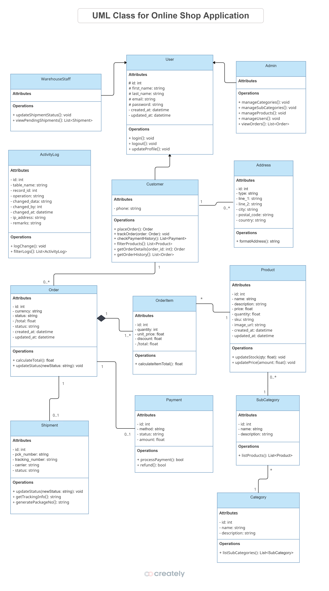
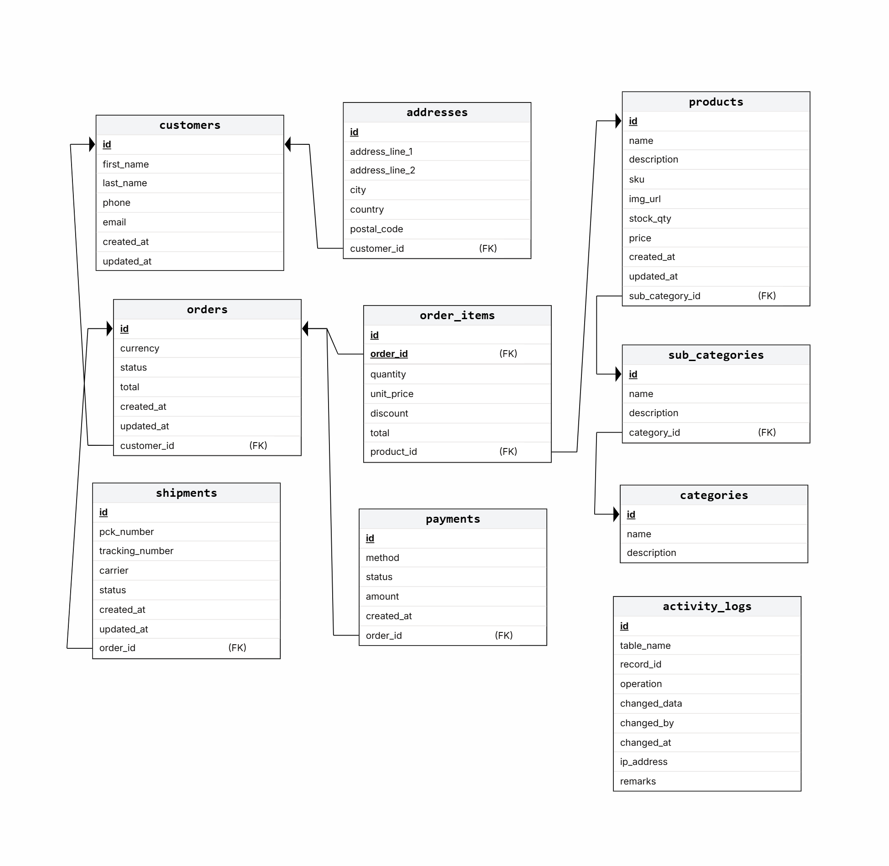

# Database Design and Programming (Group Project)

This project is being developed in parallel with the Software Application Development subject as part of our 2nd year university coursework. The goal is to apply the concepts we are learning in class such as software design, coding standards, version control, and testing to a real-world project.

## Team 06 - Members
- Lahiru Madhusanka Hewawasam Halloluwage, lionwalker, amk1002573@student.hamk.fi
- Himihami Mudiyanselage Lahiru Bandaranayake, LahiruBandaranayake, amk1004101@student.hamk.fi
- Sasvi Vidunadi Ranasinghe, sasvi23, amk1005778@student.hamk.fi'
- Udalmaththa Gamage Chathuri Anuththara Karunarathna, Anu2344, amk1004058@student.hamk.fi 

# Online Shop Application Development System 

## Project Description
This project implements an online shop application with a relational database, application design, and project management using SCRUM methodology. The system manages key business entities such as customers, products, orders, payments, shipments, categories, and order items.

Additionally, an audit log (ActivityLog) is included to track data changes (INSERT, UPDATE, DELETE) for accountability and traceability.

The design is supported by UML Class Diagrams and an ER Diagram to illustrate system structure and relationships before coding.

## Purpose
The purpose of this project is to design and implement a robust online shop system that streamlines:
- Customer management
- Product categorization
- Order processing
- Payment handling
- Shipment tracking
  
This solves the problem of manually managing shop operations by providing a scalable, digital platform.

## Learning Objectives
This project meets the goals of the Database Design and Programming module by:
- Understanding database design concepts.
- Practicing ER modeling and UML class diagrams.
- Applying normalization (1NF → 3NF).
- Implementing SQL DDL & DML for schema and sample data.
- Writing meaningful SQL queries (joins, aggregates, subqueries, etc.).
- Using Jira for SCRUM-based project management.
- Applying Git & GitHub for version control.

### How This Project Meets Course Goals  
| Course Goal                                    | How This Project Achieves It                                                                                   |
|-----------------------------------------------|-----------------------------------------------------------------------------------------------------------------|
| **Understanding database design concepts**     | Defined core entities (Customer, Product, Order, Payment, Shipment, Category, etc.), their attributes, and relationships in both ER and UML class diagrams. |
| **Practicing ER modeling and normalization**   | Designed an ER diagram and UML class diagram, and applied normalization (1NF → 3NF) to minimize redundancy and improve integrity. |
| **Implementing SQL DDL & DML**                 | Created SQL scripts for schema definition (DDL) and populated the database with sample data (DML).              |
| **Writing meaningful SQL queries**             | Developed queries for reporting, filtering, and aggregating data (e.g., total sales, customer order history, top-selling products). |
| **Using version control (GitHub)**             | Used Git & GitHub to maintain code, database scripts, diagrams, and documentation with commit history and branching. |
| **Applying project management (Jira, SCRUM)**  | Used Jira to plan sprints, assign tasks, track progress, and manage the project lifecycle following SCRUM methodology. |
| **Application/system design (UML)**            | Created UML class diagrams to model classes, attributes, methods, and relationships as a blueprint before coding. |

## Project Contents
The repository contains the following files and information:

- ER_Diagram.png – Entity Relationship diagram. (To be updated by Sasvi Vidunadi Ranasinghe)


- UML_ClassDiagram.png – Class diagram for system design. ( Created by all team membersa)
 

- Relational_Schema.png – Tables with attributes, primary/foreign keys, constraints. (Created by Lahiru Madhusanka Hewawasam Halloluwage)
 

- [Workbench_Model.mwb](docs/Workbench_Model.mwb) – Tables with attributes, primary/foreign keys, constraints. (Created by Lahiru Madhusanka Hewawasam Halloluwage)

- [DDL.sql](docs/DDL.sql) – SQL CREATE TABLE statements. (Created by Lahiru Madhusanka Hewawasam Halloluwage)

- [DML.sql](docs/DML.sql) – Sample data insertions. (Created by Lahiru Madhusanka Hewawasam Halloluwage)

- [DQL.sql](docs/DQL.sql) – Select queries (joins, aggregates, subqueries). (Created by Lahiru Madhusanka Hewawasam Halloluwage)

- README.md – Project documentation (Created and updated by Lahiru Bandaranayake)

- Presentation - Final presentation ( Planned and Finalized by Chathuri Anuththara)

## Technologies Used
- Database: MySQL 
- Tools: MySQL Workbench, ERDPlus, Draw.io, Creately, Jira
- Version Control: Git & GitHub
- Project Management: Jira (SCRUM methodology)

## Setup Instructions

### Prerequisites
- Install MySQL (or PostgreSQL if used).
- Install MySQL Workbench (optional for ER diagrams).

### Steps
1. Clone the repository:
   
    `git clone https://github.com/<username>/hamk-database-design-and-programming.git
cd hamk-database-design-and-programming`

2. Run the schema creation:

    `mysql -u username -p < DDL.sql`

3. Insert sample data:
   
    `mysql -u username -p < DML.sql`

4. Run queries:

    `mysql -u username -p < DQL.sql`

## Example Queries
To demonstrate the analytical capabilities of our database design, here’s a sample query that calculates total spend per customer by joining customers and orders tables:

```sql
SELECT 
    c.id AS customer_id, 
    CONCAT(c.first_name, ' ', c.last_name) AS customer_name,
    ROUND(SUM(o.total), 2) AS total_spent
FROM customers c
JOIN orders o ON c.id = o.customer_id
GROUP BY c.id, customer_name
ORDER BY total_spent DESC;
```

This query provides insight into customer purchasing behavior and is useful for loyalty analysis, marketing segmentation, or dashboard reporting.

**Note:** You can find more advanced queries in the [DQL.sql](docs/DQL.sql) file, including joins, aggregates, subqueries, and HAVING clauses.

## Normalization
Normalization ensures:
- Reduced redundancy
- Better data integrity
- Efficient querying

### Achieved Normal Forms

#### First Normal Form (1NF)
Definition: All attributes must be atomic (no repeating groups or arrays).
Schema:
- All columns hold single, atomic values.
- No multivalued or composite fields.
- Primary keys are defined for all tables.

####  Second Normal Form (2NF)
Definition: Must be in 1NF, and all non-key attributes must be fully functionally dependent on the whole primary key.
Schema:
- All tables use single-column primary keys.
- No partial dependencies exist.

#### Third Normal Form (3NF)
Definition: Must be in 2NF, and no transitive dependencies (non-key attributes depending on other non-key attributes).
Schema:
- No transitive dependencies.
- Derived fields like  in  and  are acceptable if documented as performance optimizations.
- Foreign keys are correctly used to link related entities.

#### Boyce-Codd Normal Form (BCNF)
Definition: Must be in 3NF, and every determinant must be a candidate key.
- All determinants are candidate keys or part of candidate keys. No violations.

Let’s check key tables:

| Table          | Determinants             | Candidate Key Description                               | BCNF Status |
|----------------|--------------------------|----------------------------------------------------------|--------------|
| customers      | id                       | Primary key on `id`                                      | In BCNF      |
| addresses      | id                       | Primary key on `id`                                      | In BCNF      |
| categories     | id                       | Primary key on `id`                                      | In BCNF      |
| sub_categori   | id                       | Primary key on `id`                                      | In BCNF      |
| products       | id, sku                  | Primary key on `id`, `sku` is unique                     | In BCNF      |
| orders         | id                       | Primary key on `id`                                      | In BCNF      |
| order_items    | id                       | Primary key on `id`                                      | In BCNF      |
| shipments      | id, tracking_number      | Primary key on `id`, `tracking_number` is unique         | In BCNF      |
| payments       | id                       | Primary key on `id`                                      | In BCNF      |
| activity_logs  | id                       | Primary key on `id`                                      | In BCNF      |


## Contribution & Version Control
- Project Management: Jira (SCRUM board for tasks, sprints).
- Version Control: Git & GitHub with branching and commits strategy.

## Project Management & Scrum Team
This project is developed using Agile Scrum methodology. We use **JIRA** to manage our backlog, sprints, and epics.

### Team Roles
- Product Owner: Sasvi Vidunadi Ranasinghe
- Scrum Master: Udalmaththa Gamage Chathuri Anuththara Karunarathna
- Developers: Lahiru Madhusanka Hewawasam Halloluwage, Himihami Mudiyanselage Lahiru Bandaranayake

To provide transparency into our Agile workflow, we’ve included screenshots from our JIRA board that illustrate how we planned and executed this project using Scrum methodology.

### Backlog Overview
- Shows prioritized user stories with clear acceptance criteria
- Includes story points and labels for epics and components

### Sprint Board
- Displays active sprint tasks across columns: To Do, In Progress, Done
- Reflects real-time collaboration and progress tracking

### Epics Breakdown
- Highlights major functional areas such as:
- User Management
- Product Catalog
- Order Workflow
- Payment Integration
- Audit Logging

These visuals demonstrate our commitment to iterative development, team coordination, and delivery of working software each sprint.

